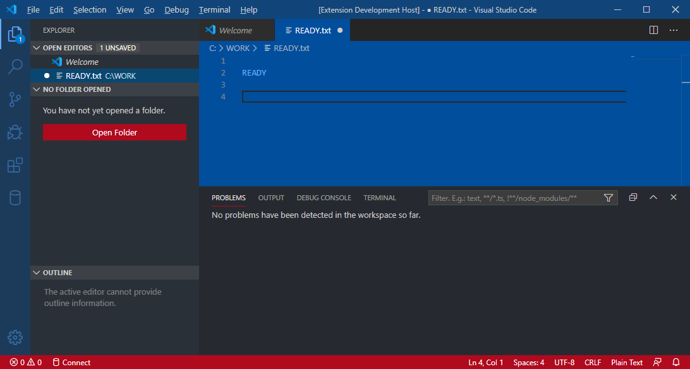

VSCode "Atari XE" color theme extension
=======================================

Changes
-------

[See list of changes here](CHANGELOG.md)

Screenshots
-----------



Problems
--------

If you see artifacting, check **Preferences: Configure Runtime Arguments** for a following setting:

```json
"disable-color-correct-rendering": false
```

Links
-----

[Theme Color documentation](https://code.visualstudio.com/api/references/theme-color)
